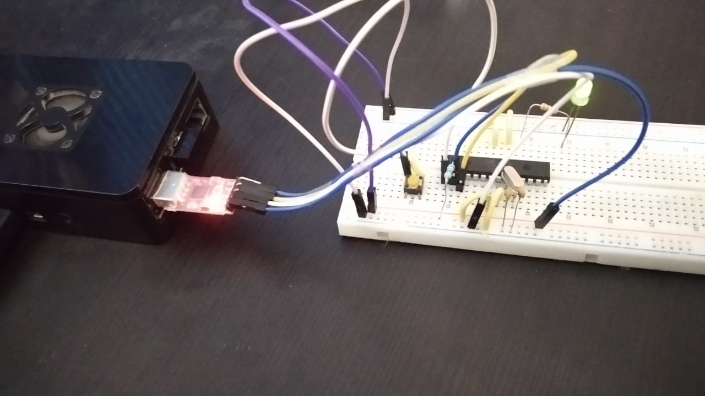

# DIY Arduino Uno 

Micro controller boards are basically programmable state machines or a mini cpu 
which does not take sizable space and has RAM and Communication functionality 
built into it. In this project we will see how to make a breadboard version 
of the famous **Arduino Uno** board.

---
### Component List 
The following is a list of things you will require for building a breadboard version 

- AtMega328p U chip 
- 16 M Hz crystal oscillator 
- 22 pF Capacitors (2 pieces)
- 10k Ohms Resistor 
- push button 
- Jumper wires and Single strand wires for connection 
- 330 Ohm resistor 
- 1 LED (green or red both would work)
- USB to UART converter (for programming)
- Breadboard 
- wire cutter 

---
### Circuit Schematic 

---
### Circuit Explanation 

The above components listed sums up the basic components needed to build a functioning 
microcontroller board. As Microcontroller is a digital Circuit it needs a clock to 
function which is why it has a crystal oscillator. Every Micrcontroller needs a reset 
switch functionality, the reset is active low so the reset pin 1 is pulled HIGH using a 
10k pull up resistor and when the switch is pressed pin 1 gets grounded and resets the mcu. 
There is a LED connected to PIN 19 which is also the D13 pin on the Arduino board. We 
will use this led to test the basic blink program on our board. Every circuit need power to 
function, so we connect the Vcc PIN 7 to +5V and PIN 8 to GND!. The USB to UART converter is 
used for providing the RX, TX, +5V and GND for the Microcontroller IC.   

To program for Arduino IDE, press the upload button and while the sketch is compiling 
you should press the reset button and release it as soon as it display uploading, that should 
program your breadboard circuit to tbe code written in IDE (this will take some practice). 

---
### Final Circuit

The Completed CIrcuit looks like below. Note that I am using a Reasberry pi to program my Microcontroller IC 

