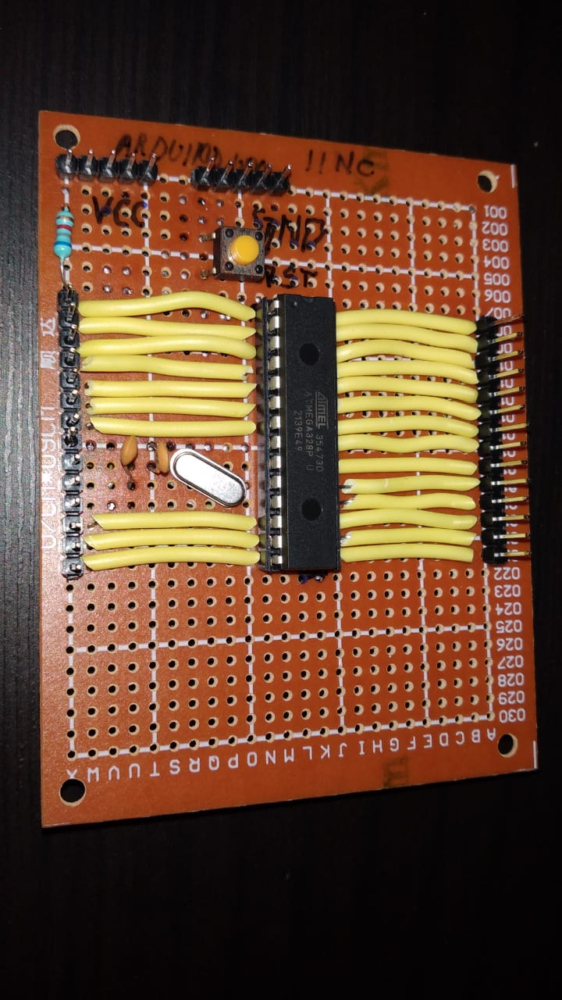
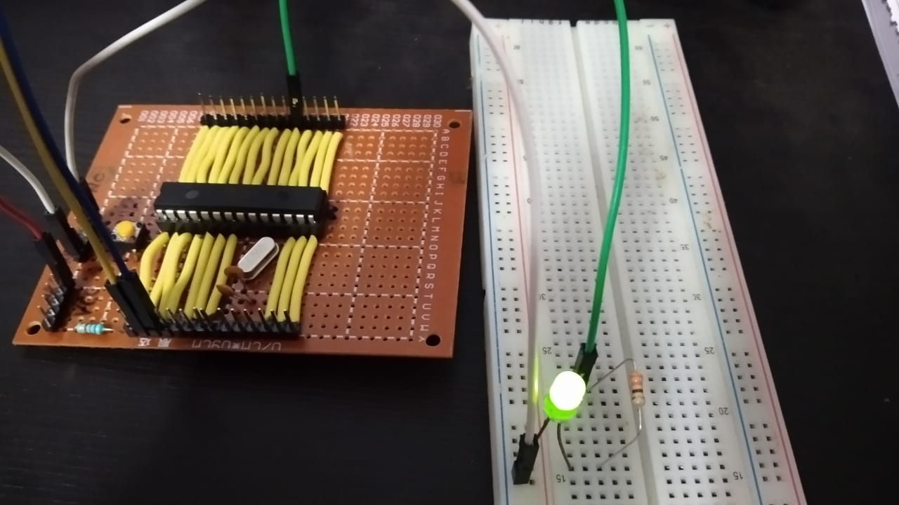

# Zero PCB Version 

This is a zero pcb soldered version of the Arduino Uno 

### Components required 

- Microcontroller (ATMEGA328p U)
- Solder wire 
- Soldering iron
- Crystal 16 M Hz 
- Single strand wires 
- Male pin headers (2x14pin, 2x5pin)
- Twizers 
- Wire cutter 
- Breadboard 
- Multimeter to check connectivity and Volts reading
- IC 28 pin socket 

### Precautions 

- While operating the soldering iron make sure you wear protective googles as we unknowingly reach close to the hot iron oftenly. ** SAFETY IS MUST ** 

- Make Sure you do not have the IC in the IC holder when you first power on the circuit for testing the voltages you get on the pins. (A good advice from friend)

- Check the adjacent pins connections as often they can lead to short as the solder can spill over to adjacent track 

### Observations 

- The microcontroller pins are difficult to solder since they are close to each other so I used wires to connect the MCU pins to the pin headers. 

- Make sure that there is no short between the VCC and GND pins of the micrcontroller and you can do that by checking the connectivity using multimeter 

- Connectivity is the most important functionality used in the Multimeter while developing the soldered PCB. 

- Make sure the soldering in not done in a cold environment or below room temperature as the solder lead takes time to heat up and it may not melt the solder wire properly thus causing difficulty in soldering. 

- You are going to require some patience so split up the task into small tasks and do one thing at a time and well !!

### End Result 

- I have programmed the Zero PCB Version using my Raspberry PI and using the UART to USB to power it as well as program it. The Blink program was successfully running on the MCU 

- the working version is shown below 

